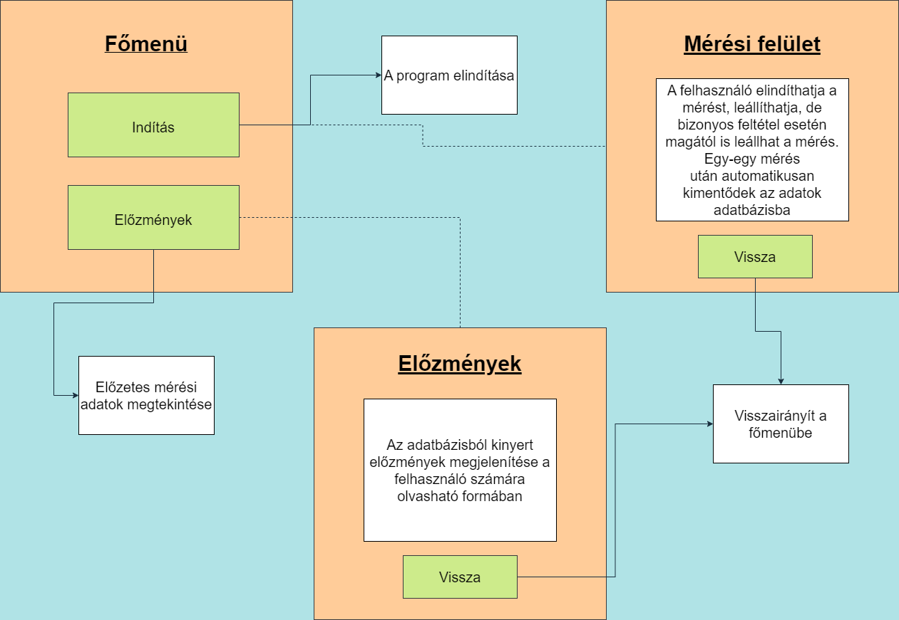

# Funkcionális specifikáció

### Áttekintés

Az általunk fejlesztett program egy Android-os telefonokra írt mérőalkalmazás.

A működés alapjául a telefonokba beépített gyorsulásmérő, valamint a gyroscope szolgál.

A program alapvető működése annyiból áll, hogy a telefonkészüléket ahogy fokozatosan mozgatjuk, az alkalmazás ezzel arányosan méri a kezdőponttól megtett távolságot.
Segítégével hosszt, távolságot tudunk mérni. Ha egy mérés megtörtént, utána a mért adatokat a program kimenti egy adatbázisba.

### Jelenlegi helyzet leírása

Világunk a modernizáció korát éli, a legtöbb eszközünk már elektronikus.
Sok szituációban azonban, például különböző méretvételek alkalmával az átlagembereknek - ácsoknak főleg - szükség lehet arra, hogy távolságokat mérjünk, méreteket vegyünk.

Ezenfajta dolgok általában colostokok, mérőszalagok segítsésével történnek, de - hacsak előre nem tudunk arról, hogy szükség lenne rá - általában
nem tartunk magunknál mérésre alkalmas eszközt. Telefonunk azonban mindig nálunk van, szinte minden szituációban, ezért is hasznos alkalmazásunk, hogy ilyen esetben tudjunk mérni.

### Vágyálom rendszer leírása

A projekt célja, hogy létrehozzunk egy olyan alkalmazást mely képes minden irányban pontos távolságot mérni kezdő- és végpont
között.

Az alkalmazás képes kell legyen a következő műveletek elvégzésére:

+ Mérési kezdőpont kijelölése felhasználói bemenetre

+ Mérési végpont megállapítása felhasználói bemenetre vagy gyroscope és gyorsulásmérő által érzékelt minimum sebesség és elmozdulás alatti paraméterek érzékelése esetén

+ Mérési végpont és kezdőpont közötti pontos távolság megállapítása

+ Mért adatok megjelenítése "metric" és "imperial" mértékegység rendszerekben

+ Mért adatok tárolása erre előkészített adatbázis rendszerben

+ Mérési előzmények megjelenítése külön alkalmazás menüben

### Követelménylista

| Modul       | ID  | Név           | v.  | Kifejtés                                                                 |
|-------------|-----|---------------|-----|--------------------------------------------------------------------------|
| Felület     | K1  | Indítás       | 1.0 | Ennek a gombnak a segítségével lépünk be a mérési felületre.             |
| Felület     | K2  | Előzmények    | 1.0 | Az előző mérések megjelenítésének felülete.                              |
| Felület     | K3  | Visszalépés   | 1.0 | A felhasználói felületekről való visszalépés az előző menübe.            |
| Felület     | K4  | Mérés indítás | 1.0 | A mérést ezzel indítjuk el vagy állítjuk le.                             |
| Felület     | K5  | Mérési adat   | 1.0 | A lemért adat megjelenítése.                                             |
| Statisztika | K6  | Lemért adatok | 1.0 | A mért adatok megjelenítése.                                             |
| Funkció     | K7  | Mérés         | 1.0 | A telefonos gyroscope és a gyorsulás szenzor segítségével távolságmérés. |

### Jelenlegi üzleti folyamatok modellje

A mai világban műszaki és otthoni környezetben is szükségünk lehet mérőeszközökre. A rendelkezésre álló eszközök most többnyire a mérőszalagok
vagy a jól ismert colostok illetve digitális távolságmérők. Ezek az eszközök megbízhatóak és többnyire a legtöbb háztartásban megtalálhatóak,
azonban bármikor kerülhetünk olyan helyzetbe, hogy mégsincsenek kéznél, de mégis mérési műveletek végzésére van szükség. A legtöbb ember
ilyen helyzetekben illetve a mindennapi élet folyamán nem tart magánál mindig ilyen mérésre alkalmas eszközöket. Továbbá a legtöbb "kézi"
mérőeszköz nem képes adattárolásra mint a különböző elektronikus megoldásuk bármelyike, ami azt eredményezi, hogy akár többszöri alkalommal
is le kell mérnünk újra és újra ugyanazokat a távolságokat szükségletektől függően. Ilyen szituációk lehetnek például különböző asztali díszek
vagy kiegészítők megfelelő méretben való vásárlása esetén történő mérések. Az ilyen szituációkban az eltárolt adatok megspórolhatnák egy-egy
mérés idejét.

### Igényelt üzleti folyamatok modellje

Telefonjaink a fentebb említett eszközökkel ellentétben általában mindig nálunk vannak és egyszerre többféle hasznos funkcionalitással is rendelkeznek
amelyek elérhetőek mobil applikációkon keresztül. Éppen ezért nem szükséges, hogy ilyen eshetőségre tarstunk magunknál különféle eszközöket, hiszen a mobilalkalmazásunkkal
képesek vagyunk mindezt megtenni. Ezáltal nem leszünk gondban, ha ilyen szituációba kerülnénk, és mérésre lenne szükség, hanem csak elővesszük telefonkészülékünket, elindítjuk
programunkat, és már meg is van oldva a probléma.
Ennek alapjaként a telefonokba beépített gyroscope és gyorsulásmérő szolgálnak, programunk is erre épülve működik. Hiszen programunk elindítása, és az 'Indítás'
gomb megnyomása után szimplán adunk egy bemenetet programunknak, és a mobilunkba beépített hardverek elkezdik működésüket, és addig végzik a mérést, amíg a felhasználó
manuálisan le nem állítja, vagy pedig egy megadott kilépési feltétel nem teljesül.

Ezenfelül - mérőeszköztől függően - táskánkban egy kis helyet is spórolunk, hiszen nem kell mást, csak legfontosabb dolgainkat magunknál tartani.

Szintén meg kell említeni, hogy alkalmazásunk a mérőeszközök hiányosságait is pótolja, hiszen sok esetben szükség lehet, hogy korábbi méréseink adatait számon tartsuk,
erre pedig megoldást nyújt programunk, hiszen alkalmazásunkban egy gomb megnyomásával elérhetjük előzményeinket, leellenőrizhetjük ha éppen egy korábbi adatra van szükségünk.
Ennek forrása egy adatbázis lesz, ahová egy mérés befejezte után az adatok kimentődnek. Miután pedig megnyomjuk az 'Előzmények' gombot, az adatbázisból kiolvasásra kerülnek
a korábbi eredmények, és betöltődnek egy, a felhasználó számára jól olvasható formában.
Ezzel megspórolhatunk néhány mérést arra az esetre, ha elfelejtenénk korábbi eredményünket.

### Funkció - követelmény megfeleltetés

1. Főmenü:

Itt találjuk meg az elindítás és az előzmények gombot.

   - indítás gomb:
     
      + a mérési felületre irányít át

   - előzmények gomb:
   
     + az előzmények felületre irányít át

2. Mérési felület:

Ezen a felületen történik meg a mérés.

   - mérés gomb:
     
     + mérés elindítása
     
     + mérés leállítása

   - a mérések automatikus elmentése az adatbázisba:

     + az adatbázisba JDBC kapcsolódáson keresztül 

   - vissza gomb:
   
     + visszairányít a főmenübe

3. Előzmények felület:

Az előzmények felületen jelennek meg a mért értékek.

   - az adatbázisba elmentett mérések megjelenítése olvasható formában:
   
     + az adatbázisból JDBC kapcsolódása keresztül

   - vissza gomb:
   
     + visszairányít a főmenübe

### Használati esetek

A program kezelését egyetlen felhasználó végzi. A hagyományos mérőeszközökkel történő mérésekhez 
hasonlóan itt sincs szükség egynél további felhasználó beavatkozására. Ő végzi az összes lehetséges 
cselekvést az alkalmazásban.

A program három felülettel rendelkezik, mindegyikben más-más dolgokat tud csinálni a felhasználó.

A főmenüben 3 gomb közül tud választani a felhasználó, melyek megnyomásával különböző dolgokat hajt 
végre. 

Az 'Indítás' gombbal átirányítódik arra a felületre, ahol a mérést tudjuk végezni. 

Az 'Előzmények' gomb megnyomásával arra a felületre jutunk, ahol meg tudjuk tekinteni korábbi méréseink
eredményét.

A 'Kilépés' gomb használatával pedig be tudjuk zárni a programot.

A mérési menüben a középen található indítógomb megnyomásával tudjuk elindítani mérésünket, valamint
leállítani, ha lemértük a kívánt távot.

Az előzményeket tartalmazó felületen végig tudjuk nézni korábbi mérésadatainkat, végig tudunk 
görgetni köztük.